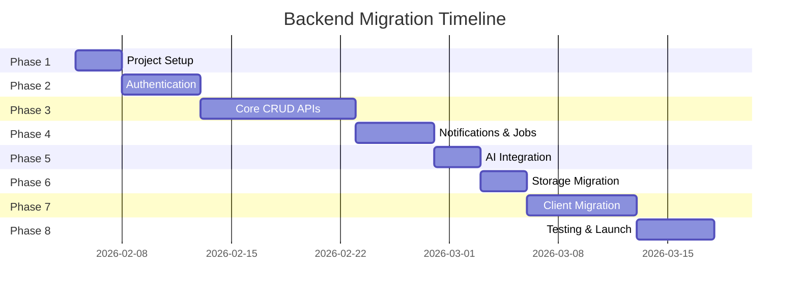
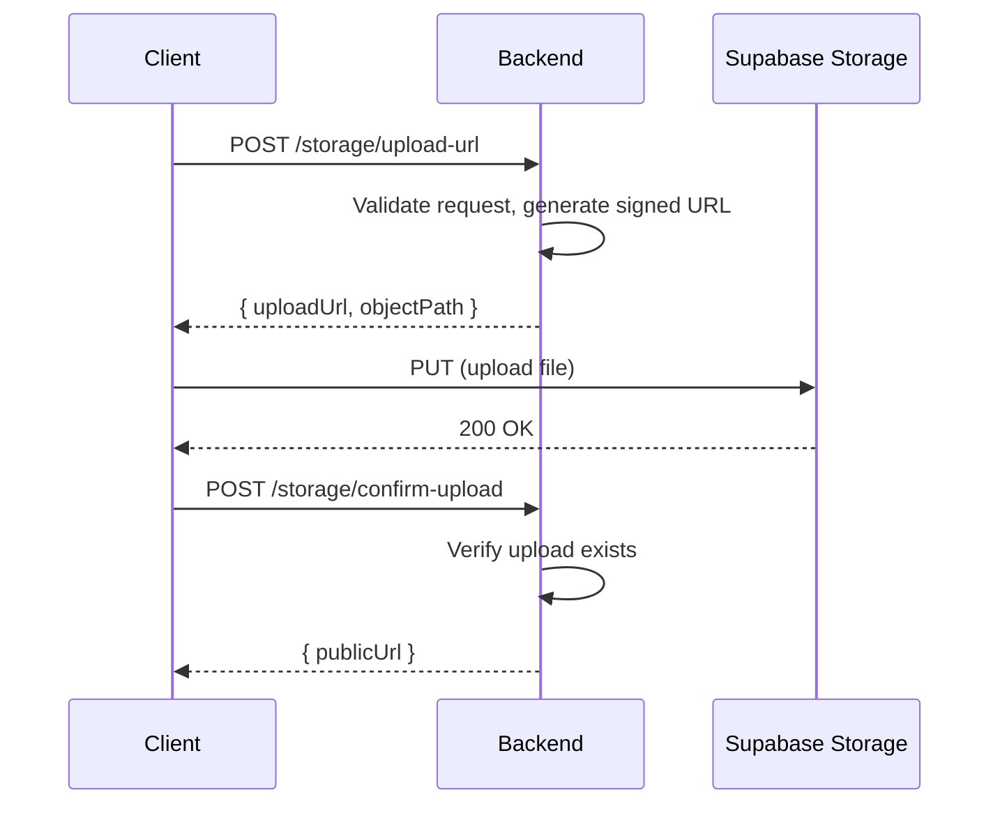

# UMak-LINK Backend Migration Plan (Fastify + Supabase BFF)

> **Goal**: Build a Fastify backend (BFF) that centralizes all Supabase access, Gemini AI calls, and session handling so both mobile and web clients reuse the same API.

---

## Executive Summary

| Aspect | Details |
|--------|---------|
| **Current State** | Mobile/web clients call Supabase directly; Gemini API keys exposed to clients |
| **Target State** | Unified Fastify API on Cloud Run; all sensitive keys server-side only |
| **Estimated Duration** | 6-8 weeks (full-time) |
| **Critical Path** | Auth → Core CRUD → Notifications → AI → Storage → Client Migration |

---

## 🔴 Critical Constraints

> [!CAUTION]
> **Security Non-Negotiables**
> - `SUPABASE_SERVICE_ROLE_KEY` must NEVER reach clients
> - Gemini API key must stay server-side only
> - Remove hard-coded bearer token in `delete_post_by_id` RPC before deployment

> [!IMPORTANT]
> **Compatibility Requirements**
> - Preserve existing view shapes: `post_public_view`, `v_post_records_details`, `fraud_reports_public_v`, `notification_view`
> - Maintain role semantics: `is_admin`, `is_staff`, `is_staff_or_admin`
> - Supabase remains source of truth—backend is a BFF, not a new database

---

## Phase Overview



---

## Phase 1: Project Setup (Days 1-3)

### Objectives
- Initialize Fastify + TypeScript backend
- Configure Cloud Run deployment
- Establish environment management

### Tasks

| # | Task | Priority | Est. |
|---|------|----------|------|
| 1.1 | Initialize backend repo with Fastify + TypeScript + ESLint + Prettier | 🔴 | 2h |
| 1.2 | Create folder structure: `src/{routes,services,middleware,types,utils}` | 🔴 | 1h |
| 1.3 | Add health check route `GET /health` | 🔴 | 30m |
| 1.4 | Configure Cloud Run: `PORT` env, structured logging, Dockerfile | 🔴 | 2h |
| 1.5 | Create `.env.example` with all required variables | 🔴 | 1h |
| 1.6 | Set up GitHub Actions for CI/CD to Cloud Run | 🟡 | 3h |

### Environment Variables

```bash
# .env.example
PORT=8080
NODE_ENV=development

# Supabase (server-only)
SUPABASE_URL=https://xxx.supabase.co
SUPABASE_SERVICE_ROLE_KEY=eyJ...  # NEVER expose to clients

# Auth
GOOGLE_CLIENT_ID=xxx.apps.googleusercontent.com
JWT_SECRET=generate-a-strong-secret
JWT_EXPIRY=7d

# AI
GEMINI_API_KEY=xxx

# Storage
SUPABASE_STORAGE_URL=https://xxx.supabase.co/storage/v1
ITEMS_BUCKET=items
PROFILE_PICTURES_BUCKET=profilePictures
```

### Folder Structure

```
backend/
├── src/
│   ├── routes/
│   │   ├── auth.ts
│   │   ├── users.ts
│   │   ├── posts.ts
│   │   ├── claims.ts
│   │   ├── fraud-reports.ts
│   │   ├── search.ts
│   │   ├── notifications.ts
│   │   ├── announcements.ts
│   │   ├── jobs.ts
│   │   └── storage.ts
│   ├── services/
│   │   ├── supabase.ts      # Supabase client wrapper
│   │   ├── gemini.ts        # Gemini AI service
│   │   ├── notifications.ts # FCM service
│   │   └── storage.ts       # Storage operations
│   ├── middleware/
│   │   ├── auth.ts          # JWT verification + role checks
│   │   └── error-handler.ts
│   ├── types/
│   │   ├── auth.ts
│   │   ├── posts.ts
│   │   ├── claims.ts
│   │   ├── fraud-reports.ts
│   │   ├── notifications.ts
│   │   └── common.ts
│   ├── utils/
│   │   ├── validation.ts
│   │   └── logger.ts
│   └── index.ts
├── tests/
├── Dockerfile
├── package.json
└── tsconfig.json
```

### Milestone ✅
- [ ] Backend starts locally with `npm run dev`
- [ ] `GET /health` returns `200 OK`
- [ ] Deploys to Cloud Run staging

---

## Phase 2: Authentication (Days 4-8)

### Objectives
- Google OAuth token verification
- JWT session issuance
- Role-based middleware

### Dependencies
- Phase 1 complete
- Google OAuth Client ID configured

### Tasks

| # | Task | Priority | Est. |
|---|------|----------|------|
| 2.1 | Implement `POST /auth/google` - verify Google ID token, upsert user, issue JWT | 🔴 | 4h |
| 2.2 | Implement `GET /auth/me` - return current user profile | 🔴 | 1h |
| 2.3 | Create auth middleware: `requireAuth`, `requireStaff`, `requireAdmin` | 🔴 | 3h |
| 2.4 | Mirror DB role helpers in middleware (`is_staff`, `is_admin`, `is_staff_or_admin`) | 🔴 | 2h |
| 2.5 | Add JWT refresh mechanism (optional, can use long-lived tokens initially) | 🟡 | 2h |

### API Contracts

```typescript
// POST /auth/google
interface AuthLoginRequest {
  googleIdToken: string;
}

interface AuthLoginResponse {
  token: string;
  user: UserProfile;
}

// GET /auth/me
interface AuthMeResponse {
  user: UserProfile;
}

interface UserProfile {
  user_id: string;
  user_name: string | null;
  email: string | null;
  profile_picture_url: string | null;
  user_type: 'User' | 'Staff' | 'Admin';
  notification_token: string | null;
}
```

### Auth Middleware Pattern

```typescript
// middleware/auth.ts
export const requireAuth = async (request, reply) => {
  const token = request.headers.authorization?.replace('Bearer ', '');
  if (!token) return reply.status(401).send({ error: 'Unauthorized' });
  
  try {
    const decoded = jwt.verify(token, process.env.JWT_SECRET);
    request.user = decoded;
  } catch {
    return reply.status(401).send({ error: 'Invalid token' });
  }
};

export const requireStaff = async (request, reply) => {
  await requireAuth(request, reply);
  if (!['Staff', 'Admin'].includes(request.user?.user_type)) {
    return reply.status(403).send({ error: 'Staff access required' });
  }
};

export const requireAdmin = async (request, reply) => {
  await requireAuth(request, reply);
  if (request.user?.user_type !== 'Admin') {
    return reply.status(403).send({ error: 'Admin access required' });
  }
};
```

### Milestone ✅
- [ ] Can login with Google ID token and receive JWT
- [ ] JWT can be used to access protected routes
- [ ] Role checks work correctly (User/Staff/Admin)

---

## Phase 3: Core CRUD APIs (Days 9-18)

### Objectives
- Implement all post/item/claim/fraud CRUD operations
- Replace Supabase RPC calls with API endpoints
- Enforce enum validations

### Dependencies
- Phase 2 complete (auth middleware available)

### 3A: Posts & Items (Days 9-13)

| # | Task | Priority | Est. |
|---|------|----------|------|
| 3A.1 | `POST /posts` - create post with item (replace `create_post_with_item_date_time_location`) | 🔴 | 4h |
| 3A.2 | `PUT /posts/:id` - edit post (replace `edit_post_with_item_date_time_location`) | 🔴 | 3h |
| 3A.3 | `GET /posts/public` - list posts from `post_public_view` | 🔴 | 2h |
| 3A.4 | `GET /posts/:id` - single post detail | 🔴 | 1h |
| 3A.5 | `GET /posts/:id/full` - staff view from `v_post_records_details` | 🔴 | 2h |
| 3A.6 | `DELETE /posts/:id` - delete post + storage cleanup (replace `delete_post_by_id`) | 🔴 | 3h |
| 3A.7 | `PUT /posts/:id/status` - update post status | 🔴 | 2h |
| 3A.8 | `PUT /items/:id/status` - update item status | 🔴 | 2h |

### Validation Rules (from schema)

```typescript
// Enums to enforce
type ItemType = 'found' | 'lost' | 'missing';
type ItemStatus = 'claimed' | 'unclaimed' | 'discarded' | 'returned' | 'lost';
type PostStatus = 'pending' | 'accepted' | 'rejected' | 'archived' | 'deleted' | 'reported' | 'fraud';

// create_post validation
interface CreatePostRequest {
  p_item_name: string;       // required, non-empty
  p_item_description?: string;
  p_item_type: ItemType;
  p_poster_id: string;
  p_image_hash: string;      // required, non-empty
  p_category?: string;
  p_date_day?: number;
  p_date_month?: number;
  p_date_year?: number;
  p_time_hour?: number;      // 0-23
  p_time_minute?: number;    // 0-59
  p_location_path: Array<{ name: string; type: string }>;  // required, JSON array
  p_is_anonymous?: boolean;
}
```

### 3B: Claims (Days 14-15)

| # | Task | Priority | Est. |
|---|------|----------|------|
| 3B.1 | `POST /claims/process` - process claim (replace `process_claim` RPC) | 🔴 | 4h |
| 3B.2 | `GET /claims/by-item/:itemId` - check existing claim | 🔴 | 2h |

### 3C: Fraud Reports (Days 16-17)

| # | Task | Priority | Est. |
|---|------|----------|------|
| 3C.1 | `POST /fraud-reports` - create fraud report | 🔴 | 3h |
| 3C.2 | `GET /fraud-reports` - list reports from `fraud_reports_public_v` | 🔴 | 2h |
| 3C.3 | `PATCH /fraud-reports/:id/status` - update status | 🔴 | 2h |
| 3C.4 | `POST /fraud-reports/:id/resolve` - resolve report (migrate `resolve_fraud_report` logic) | 🔴 | 4h |

> [!WARNING]
> **Schema Mismatch**: `resolve_fraud_report` updates `item_table.returned_at` but schema only has `returned_at_local`. Decide whether to add `returned_at` column or update function.

### 3D: Search (Day 18)

| # | Task | Priority | Est. |
|---|------|----------|------|
| 3D.1 | `POST /search/items` - user search (replace `search_items_fts`) | 🔴 | 3h |
| 3D.2 | `POST /search/items/staff` - staff search with more filters | 🔴 | 2h |
| 3D.3 | `GET /users/search` - admin/staff user search | 🔴 | 2h |
| 3D.4 | Decide: keep rate limiting in DB or move to Fastify | 🟡 | 1h |

### 3E: Admin (Day 18)

| # | Task | Priority | Est. |
|---|------|----------|------|
| 3E.1 | `GET /admin/dashboard-stats` - dashboard statistics | 🟡 | 2h |
| 3E.2 | `POST /audit-logs` - insert audit log | 🟡 | 1h |
| 3E.3 | `GET /audit-logs` - list audit logs with user details | 🟡 | 2h |

### Milestone ✅
- [ ] All CRUD operations work via API
- [ ] Enum validations enforced
- [ ] View column contracts preserved

---

## Phase 4: Notifications & Background Jobs (Days 19-23)

### Objectives
- Centralize notification creation and FCM delivery
- Migrate edge functions to Fastify routes
- Set up scheduled jobs

### Dependencies
- Phase 3 complete
- FCM configured in backend

### Tasks

| # | Task | Priority | Est. |
|---|------|----------|------|
| 4.1 | `POST /notifications/send` - create notification + send FCM | 🔴 | 4h |
| 4.2 | `GET /notifications` - list user notifications | 🔴 | 2h |
| 4.3 | `GET /notifications/count` - unread count | 🔴 | 1h |
| 4.4 | `PATCH /notifications/:id/read` - mark as read | 🔴 | 1h |
| 4.5 | `DELETE /notifications/:id` - delete notification | 🔴 | 1h |
| 4.6 | `POST /announcements/send` - global announcement | 🔴 | 3h |
| 4.7 | `GET /announcements` - list announcements | 🔴 | 2h |
| 4.8 | `POST /email/send` - send email (migrate edge function) | 🟡 | 2h |

### Edge Function → API Migration

| Edge Function | New Route | Auth |
|---------------|-----------|------|
| `send-notification/index.ts` | `POST /notifications/send` | staff/admin/system |
| `send-global-announcements/index.ts` | `POST /announcements/send` | admin/staff |
| `send-email/index.ts` | `POST /email/send` | staff/admin/system |
| `generate-metadata-batch/index.ts` | `POST /jobs/metadata-batch` | system |
| `send-pending-match/index.ts` | `POST /jobs/pending-match` | system |
| `delete-item-in-bucket/index.ts` | `DELETE /storage/item` | staff/admin/system |

### Background Job Setup

```sql
-- pg_cron jobs (run in Supabase)
SELECT cron.schedule(
  'metadata-batch',
  '*/10 * * * *',  -- every 10 minutes
  $$SELECT net.http_post(
    url := 'https://your-backend/jobs/metadata-batch',
    headers := '{"Authorization": "Bearer <system-token>"}'
  )$$
);

SELECT cron.schedule(
  'pending-match',
  '*/10 * * * *',
  $$SELECT net.http_post(
    url := 'https://your-backend/jobs/pending-match',
    headers := '{"Authorization": "Bearer <system-token>"}'
  )$$
);
```

### Milestone ✅
- [ ] Notifications send via backend API
- [ ] FCM push delivery works
- [ ] Background jobs run on schedule

---

## Phase 5: Gemini AI Integration (Days 24-26)

### Objectives
- Move all Gemini calls server-side
- Implement metadata generation and matching

### Dependencies
- Phase 4 complete
- Gemini API key configured

### Tasks

| # | Task | Priority | Est. |
|---|------|----------|------|
| 5.1 | Create `GeminiService` with rate limiting and retries | 🔴 | 3h |
| 5.2 | `POST /ai/generate-metadata` - generate item metadata | 🔴 | 4h |
| 5.3 | `POST /jobs/metadata-batch` - batch process pending items | 🔴 | 4h |
| 5.4 | `POST /jobs/pending-match` - match lost/found items | 🔴 | 4h |
| 5.5 | Add queue/retry mechanism for failed AI calls | 🟡 | 3h |

### Gemini Service Pattern

```typescript
// services/gemini.ts
class GeminiService {
  private rateLimiter: RateLimiter;
  
  async generateMetadata(item: ItemData): Promise<Metadata> {
    await this.rateLimiter.acquire();
    try {
      const response = await this.client.generateContent({
        contents: [{ parts: [{ text: this.buildPrompt(item) }] }]
      });
      return this.parseResponse(response);
    } catch (error) {
      if (error.code === 429) {
        // Add to retry queue
        await this.queueForRetry(item);
      }
      throw error;
    }
  }
}
```

### Milestone ✅
- [ ] Gemini calls work from backend
- [ ] Metadata batch job processes items
- [ ] Match job notifies users of potential matches

---

## Phase 6: Storage Migration (Days 27-29)

### Objectives
- Backend-controlled uploads (signed URLs or proxy)
- Remove direct storage access from clients

### Dependencies
- Phase 3 complete (posts API available)

### Tasks

| # | Task | Priority | Est. |
|---|------|----------|------|
| 6.1 | `POST /storage/upload-url` - generate signed upload URL | 🔴 | 3h |
| 6.2 | `POST /storage/confirm-upload` - confirm upload completed | 🔴 | 2h |
| 6.3 | `DELETE /storage/item` - delete storage object | 🔴 | 2h |
| 6.4 | `POST /storage/profile-picture` - upload profile picture | 🔴 | 2h |
| 6.5 | Update post creation to use new upload flow | 🔴 | 2h |

### Upload Flow



### Milestone ✅
- [ ] File uploads work via signed URLs
- [ ] Profile pictures upload correctly
- [ ] Storage deletion works from backend

---

## Phase 7: Client Migration (Days 30-36)

### Objectives
- Replace all `supabase.*` calls with API client
- Update auth flow
- Remove client-side Gemini calls

### Dependencies
- Phases 1-6 complete
- All API endpoints tested

### 7A: Create API Client (Day 30)

```typescript
// src/shared/lib/api.ts
class ApiClient {
  private baseUrl: string;
  private token: string | null;
  
  async request<T>(method: string, path: string, body?: any): Promise<T> {
    const response = await fetch(`${this.baseUrl}${path}`, {
      method,
      headers: {
        'Content-Type': 'application/json',
        ...(this.token && { 'Authorization': `Bearer ${this.token}` })
      },
      body: body ? JSON.stringify(body) : undefined
    });
    
    if (!response.ok) {
      throw new ApiError(response.status, await response.json());
    }
    
    return response.json();
  }
  
  // Typed methods
  posts = {
    list: () => this.request<PostListResponse>('GET', '/posts/public'),
    get: (id: number) => this.request<PostRecord>('GET', `/posts/${id}`),
    create: (data: CreatePostRequest) => this.request<PostRecord>('POST', '/posts', data),
    // ...
  };
}

export const api = new ApiClient();
```

### 7B: Files to Migrate (Days 31-36)

Organized by priority and dependency:

#### Critical Path (Do First)
| File | Changes |
|------|---------|
| `src/shared/lib/supabase.ts` | Remove or replace with API client |
| `src/features/auth/services/authServices.tsx` | Use `POST /auth/google` |
| `src/features/auth/contexts/UserContext.tsx` | Store backend JWT |
| `src/features/auth/hooks/useAuth.tsx` | Use auth API |
| `src/features/auth/pages/Auth.tsx` | Update login flow |

#### Posts & Items
| File | Changes |
|------|---------|
| `src/features/posts/data/posts.ts` | Use posts API |
| `src/features/posts/data/postsRefresh.ts` | Use posts API |
| `src/features/user/services/postServices.tsx` | Use posts API |
| `src/features/user/hooks/usePostActions.tsx` | Use posts API |
| `src/features/staff/hooks/usePostStaffServices.tsx` | Use posts API |
| `src/features/staff/hooks/useStaffPostActions.tsx` | Use posts API |
| `src/shared/components/PostList.tsx` | Use posts API |

#### Search
| File | Changes |
|------|---------|
| `src/features/user/hooks/useSearch.tsx` | Use search API |
| `src/features/staff/hooks/useStaffSearch.tsx` | Use search API |
| `src/features/admin/hooks/useStaffSearch.ts` | Use users search API |

#### Claims & Fraud
| File | Changes |
|------|---------|
| `src/features/staff/hooks/useClaimItemSubmit.ts` | Use claims API |
| `src/features/staff/hooks/useExistingClaimCheck.ts` | Use claims API |
| `src/features/user/hooks/usePostActions.tsx` | Use fraud API |
| `src/features/staff/hooks/useFraudReports.tsx` | Use fraud API |
| `src/features/staff/pages/ExpandedFraudReport.tsx` | Use fraud API |

#### Notifications
| File | Changes |
|------|---------|
| `src/features/user/hooks/useNotifications.ts` | Use notifications API |
| `src/features/user/hooks/useUnreadNotificationCount.ts` | Use notifications API |
| `src/features/admin/pages/Announcement.tsx` | Use announcements API |

#### Admin & Storage
| File | Changes |
|------|---------|
| `src/features/admin/data/dashboardStats.ts` | Use admin API |
| `src/shared/hooks/useAuditLogs.tsx` | Use audit API |
| `src/shared/utils/supabaseStorageUtils.ts` | Use storage API |

#### AI (Remove)
| File | Changes |
|------|---------|
| `src/shared/lib/geminiApi.ts` | Delete or stub (server-only now) |
| `src/features/staff/utils/catalogPostHandlers.ts` | Remove Gemini calls |

### Milestone ✅
- [ ] API client created and typed
- [ ] All Supabase direct calls removed
- [ ] App works with backend API

---

## Phase 8: Testing & Launch (Days 37-41)

### Objectives
- Comprehensive testing
- Production deployment
- Rollback plan

### Tasks

| # | Task | Priority | Est. |
|---|------|----------|------|
| 8.1 | Write integration tests for all API endpoints | 🔴 | 8h |
| 8.2 | Test role-based access (Admin/Staff/User) | 🔴 | 4h |
| 8.3 | Smoke test on mobile (iOS + Android) | 🔴 | 4h |
| 8.4 | Smoke test on web | 🔴 | 2h |
| 8.5 | Load testing (optional but recommended) | 🟡 | 4h |
| 8.6 | Deploy to production Cloud Run | 🔴 | 2h |
| 8.7 | Update DNS/CORS configuration | 🔴 | 1h |
| 8.8 | Monitor logs and errors | 🔴 | ongoing |

### Testing Matrix

| Feature | Unit Test | Integration Test | E2E |
|---------|-----------|------------------|-----|
| Auth | ✅ | ✅ | ✅ |
| Posts CRUD | ✅ | ✅ | ✅ |
| Claims | ✅ | ✅ | ✅ |
| Fraud Reports | ✅ | ✅ | ✅ |
| Search | - | ✅ | ✅ |
| Notifications | - | ✅ | ✅ |
| AI Jobs | - | ✅ | - |
| Storage | - | ✅ | ✅ |

### Rollback Plan

1. Keep Supabase RLS policies active during transition
2. Feature flag to switch between direct Supabase and API
3. Database remains unchanged—can revert to old client code
4. Deploy new backend version in staging first, A/B test if possible

### Milestone ✅
- [ ] All tests passing
- [ ] Mobile app works on staging
- [ ] Web app works on staging
- [ ] Production deployment complete

---

## Risk Mitigation

| Risk | Likelihood | Impact | Mitigation |
|------|------------|--------|------------|
| Auth token leaks | Medium | High | Use short-lived JWTs, HTTPS only, audit logging |
| Supabase rate limits | Low | Medium | Add caching layer, optimize queries |
| Gemini API failures | Medium | Medium | Queue + retry mechanism, graceful degradation |
| Migration breaks existing users | Medium | High | Feature flags, gradual rollout, keep old code path |
| Schema mismatches | High | Medium | Audit DB schema vs code expectations before Phase 3 |

---

## Pre-Migration Checklist

Run these before starting Phase 1:

- [ ] Confirm schema dump `sql/schema-only.sql` matches production
- [ ] Download latest edge functions to `supabase/functions/`
- [ ] Decide: Add `returned_at` column or update `resolve_fraud_report`?
- [ ] Remove hard-coded bearer token from `delete_post_by_id`
- [ ] Confirm rate limiting strategy (DB, Fastify, or both?)
- [ ] Set up Cloud Run project and service account
- [ ] Configure Firebase Admin SDK for FCM

---

## Type Definitions Reference

<details>
<summary>Click to expand full TypeScript types</summary>

```typescript
// ======================
// AUTH TYPES
// ======================
interface AuthLoginRequest {
  googleIdToken: string;
}

interface AuthLoginResponse {
  token: string;
  user: UserProfile;
}

interface AuthMeResponse {
  user: UserProfile;
}

interface UserProfile {
  user_id: string;
  user_name: string | null;
  email: string | null;
  profile_picture_url: string | null;
  user_type: 'User' | 'Staff' | 'Admin';
  notification_token: string | null;
}

interface UserSearchResponse {
  results: UserProfile[];
}

// ======================
// POST TYPES
// ======================
type ItemType = 'found' | 'lost' | 'missing';
type ItemStatus = 'claimed' | 'unclaimed' | 'discarded' | 'returned' | 'lost';
type PostStatus = 'pending' | 'accepted' | 'rejected' | 'archived' | 'deleted' | 'reported' | 'fraud';

interface CreatePostRequest {
  p_item_name: string;
  p_item_description?: string;
  p_item_type: ItemType;
  p_poster_id: string;
  p_image_hash: string;
  p_category?: string;
  p_date_day?: number;
  p_date_month?: number;
  p_date_year?: number;
  p_time_hour?: number;
  p_time_minute?: number;
  p_location_path: Array<{ name: string; type: string }>;
  p_is_anonymous?: boolean;
}

interface EditPostRequest extends Partial<CreatePostRequest> {
  post_id: number;
}

interface PostRecord {
  post_id: number;
  item_id: string;
  poster_name: string;
  poster_id: string;
  item_name: string;
  item_description: string | null;
  item_type: ItemType;
  item_image_url: string;
  category: string | null;
  last_seen_at: string | null;
  last_seen_location: string | null;
  submission_date: string;
  post_status: PostStatus;
  item_status: ItemStatus;
  accepted_by_staff_name: string | null;
  accepted_by_staff_email: string | null;
  claim_id: string | null;
  claimed_by_name: string | null;
  claimed_by_email: string | null;
  claim_processed_by_staff_id: string | null;
  accepted_on_date: string | null;
  is_anonymous: boolean;
}

interface PostRecordDetails extends PostRecord {
  linked_lost_item_id: string | null;
  returned_at_local: string | null;
}

interface PostListResponse {
  posts: PostRecord[];
  count?: number;
}

interface UpdatePostStatusRequest {
  status: PostStatus;
  rejection_reason?: string;
}

interface UpdateItemStatusRequest {
  status: ItemStatus;
}

// ======================
// CLAIM TYPES
// ======================
interface ProcessClaimRequest {
  found_post_id: number;
  missing_post_id?: number | null;
  claim_details: {
    claimer_name: string;
    claimer_school_email: string;
    claimer_contact_num: string;
    poster_name: string;
    staff_id: string;
    staff_name: string;
  };
}

interface ExistingClaimResponse {
  exists: boolean;
  claim?: {
    claim_id: string;
    claimer_name: string;
    claimer_email: string;
    claimed_at: string;
  };
}

// ======================
// FRAUD REPORT TYPES
// ======================
type FraudReportStatus = 'under_review' | 'verified' | 'rejected' | 'resolved' | 'open';

interface FraudReportCreateRequest {
  post_id: number;
  reason: string;
  proof_image_url?: string | null;
  reported_by?: string | null;
  claim_id?: string | null;
  claimer_name?: string | null;
  claimer_school_email?: string | null;
  claimer_contact_num?: string | null;
  claimed_at?: string | null;
  claim_processed_by_staff_id?: string | null;
}

interface FraudReportPublic {
  report_id: string;
  post_id: number;
  reason: string;
  status: FraudReportStatus;
  created_at: string;
  reporter: UserProfile | null;
  poster: UserProfile;
  claim_info: object | null;
  item_info: object;
}

interface FraudReportListResponse {
  reports: FraudReportPublic[];
  count?: number;
}

interface FraudReportStatusRequest {
  status: FraudReportStatus;
}

interface FraudReportResolveRequest {
  delete_claim?: boolean;
}

// ======================
// SEARCH TYPES
// ======================
interface SearchItemsRequest {
  query: string;
  limit?: number;
  last_seen_date?: string | null;
  category?: string[] | null;
  location_last_seen?: string | null;
  claim_from?: string | null;
  claim_to?: string | null;
  item_status?: ItemStatus[] | null;
  sort?: 'submission_date';
  sort_direction?: 'asc' | 'desc';
}

interface SearchItemsStaffRequest extends SearchItemsRequest {
  sort?: 'accepted_on_date' | 'submission_date';
}

// ======================
// NOTIFICATION TYPES
// ======================
interface SendNotificationRequest {
  user_id: string;
  title: string;
  body: string;
  description?: string | null;
  type: string;
  data?: Record<string, any>;
  image_url?: string | null;
}

interface NotificationRecord {
  notification_id: number;
  user_id: string;
  title: string;
  body: string;
  type: string;
  is_read: boolean;
  created_at: string;
  image_url?: string | null;
}

interface SendGlobalAnnouncementRequest {
  user_id: string;
  message: string;
  description?: string | null;
  image_url?: string | null;
}

interface AnnouncementRecord {
  global_notification_id: number;
  message: string;
  description: string | null;
  created_at: string;
  image_url?: string | null;
}

// ======================
// JOB TYPES
// ======================
interface GenerateMetadataBatchResponse {
  processed: number;
  succeeded: number;
  failed: number;
  results: Array<{
    item_id: string;
    success: boolean;
    error?: string | null;
  }>;
}

interface ProcessPendingMatchResponse {
  total_pending: number;
  processed: number;
  failed: number;
  remaining: number;
  timed_out: boolean;
  rate_limit_stopped: boolean;
}

// ======================
// ADMIN TYPES
// ======================
interface DashboardStats {
  pending_verifications: number;
  pending_fraud_reports: number;
  claimed_count: number;
  unclaimed_count: number;
  to_review_count: number;
  lost_count: number;
  returned_count: number;
  reported_count: number;
}
```

</details>

---

## Quick Reference: RPC → API Mapping

| Supabase RPC | Backend Route | Auth |
|--------------|---------------|------|
| `create_post_with_item_date_time_location` | `POST /posts` | user/staff |
| `edit_post_with_item_date_time_location` | `PUT /posts/:id` | user/staff |
| `delete_post_by_id` | `DELETE /posts/:id` | user/staff |
| `process_claim` | `POST /claims/process` | staff |
| `search_items_fts` | `POST /search/items` | user |
| `search_items_fts_staff` | `POST /search/items/staff` | staff/admin |
| `search_users_secure` | `GET /users/search` | admin |
| `search_users_secure_staff` | `GET /users/search` | staff |
| `create_or_get_fraud_report` | `POST /fraud-reports` | user |
| `get_dashboard_stats` | `GET /admin/dashboard-stats` | admin |
| `insert_audit_log` | `POST /audit-logs` | staff/admin |
| `resolve_fraud_report` | `POST /fraud-reports/:id/resolve` | staff/admin |
